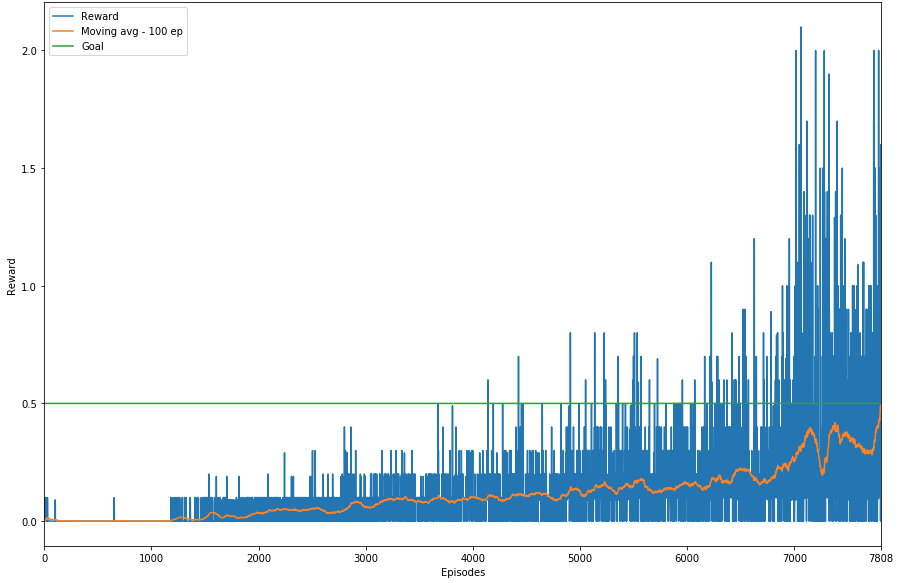

# Project Continuous Control Report

## Description

In this project, the goal is to control two rackets to pass the ball constantly across the net. If the agent controlling the racket successfully passes the ball across the net it recieves a reward of +0.1. If the ball hits the ground or crosses the boundaries, the agent recieves a reward of -0.01. Rewards will be maximized if the two agents can pass the ball across.

The observation space consists of 8 variables corresponding to the position and velocity of the ball and racket. Each agent receives its own, local observation. Two continuous actions are available, corresponding to movement towards (or away from) the net, and jumping. The task is episodic. Specifically, after each episode, we add up the rewards that each agent received (without discounting), to get a score for each agent. This yields two different scores. We then take the maximum of these two scores. This yields a single score for each episode. The environment is considered solved if the agents get an average score of +0.5 (over 100 consecutive episodes, after taking the maximum over both agents)

## Algorithm

I use Deep Deterministic Policy Gradient (Actor-Critic) algorithm to train the agents since the actions are in continuous spaces. I use 2 different agents, each corresponding to the individual rackets. 

The actor network predicts the action to be taken by looking at the current state. It has a tanh activation at the output layer (since action space is continuous and in the range -1 to 1). The critic network decides the value of the state-action pair (using Bellman equation). The descriptions of the Actor and Critic network are described below:

**Actor:**

- Input Layer    : 24 features
- Hidden Layer 1 : 256 neurons
- Hidden Layer 2 : 256 neurons
- Output Layer   : 2 neurons (tanh activation representing two continuous action space - one for movement towards or away from the net and other for jumping)

**Critic**

- Input Layer    : 24 features
- Concat Layer   : (24 from previous layer + 2 from output layer of Actor Network)
- Hidden Layer 1 : 512 neurons
- Output Layer   : 1 (Representing the value of state action pair)

**Both the agents controlling the rackets use the same architecture for their respective Actor and Critic networks as described above.**

Both agents were trained using Adam Optimizer with an initial learning rate of 0.001 for actor network and 0.0001 for critic network, for a maximum of 50000 epochs. Replay buffer with a size of 20000 was used. The model was trained to explore during initial phase of training with epsilon set to 1 and gradually decaying it by 0.5% every epoch until it decayed upto 0.01 and then keping it fixed. The decay was introduced to account into the factor that the model learns to perform better as training progresses, and we can rely on recent observations. I also added Ornstein-Uhlenbeck noise with parameters(theta=0.15 and sigma=0.2) to aid in exploration. The OU noise is temporally correlated and is found to be useful over random noise for control tasks.

## Results

The above graph shows the maximum reward received by either of the agents and the moving average of the rewards over 100 episodes. We observe that in the early stages of the training the reward was zero for most of the episodes. One reason could be because the network sizes used for both actor and critic were large and thus it took longer to train. 

Over time, the agents learnt to pass the ball across and get better rewards. As seen in the graph, the agents were able to collaborate and acheive the goal of 0.5 after 7808 episodes. 

## Future Work

- I would like to train agents with smaller network size and see if this results in faster training i.e. lower episodes to acheive the goal.
- As described in the results section, I would like to explore why the agent was getting zero rewards at the begining of training. 
- There was a sudden drop in the reward (as seen in the graph around 7300 epoch). I would like to explore why this drop occured i.e. do we see similar behavior with smaller networks or do we see similar behavior with same network but with different initialization or was it just a random behavior. 
- I would also like to try out prioritized experience replay and see if it improves the train time. 